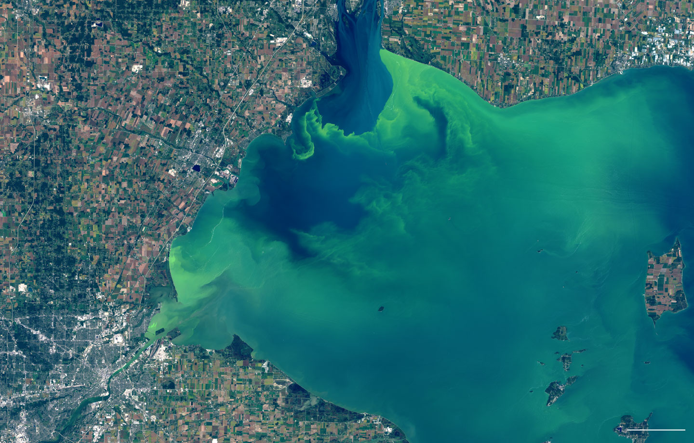

```{r setup, include=FALSE}
knitr::opts_chunk$set(echo = TRUE)
```
# Water Quality Prediction and Classification of Continental US lakes



<p style="font-size: 10px;"> Source: New York Times (2017) </p>

## Abstract

Natural environmental systems are very complex and one such example is the ecosystems of lakes. Due to thier invaluable importance understanding the systems with the help of data-driven machine learning algorithms is important. Currently, there is large volume of data that is available for processing and analysis. We can use Data science tools on this dataset to understand the lakes and the processes. I have applied different predictive models to assess the predictability of chlorophyll concentration in lakes. The models were trained and tested resulting in a good result which can be used with some caution and also further improved up on. In addition, I have analyzed the data by using different clustering algorithms to understand the type of lakes in the United States. The results indicate that at least there are two unique clusters of lakes and clustering algorithms can also be used to classify lakes to identify their trophic states.


## Motivation

Data science is an exciting and a very power full field of study allowing us mine plethora of available data to help us understand phenomena that cannot be explored using other traditional methods.  This is also true when it comes to environmental data, both from natural and engineered systems being very complex and often handled with process based mathematical and numerical models. This tools alone, although they are powerful and have been used successfully, using data science approaches can greatly reduce the efforts put to develop this tool and, in the area, where they fail. To demonstrate this idea, I have chosen to apply the different data science and predictive analytics methods on environmental data. Specifically, I will be working on water quality data for the continental US lakes.  

## About the data

The U.S. Environmental Protection Agency (USEPA) has implemented National Lakes Assessment project partnering with States and Tribes. The NLA is a national scale sampling program to understand current conditions, track environmental improvements and to inform decisions at a larger scale [^1] [^7]. In this effort, USEPA conducts field sampling for over 1000 lakes across the continental US. The sampling has been done so far for the year 2007 and 2012. The sampling included lakes (lakes, reservoirs, and ponds) within the 48 contiguous United States which have area greater than 1 ha and depth greater than 1 m. The resulting data comprises biological, chemical and human land use features [^1]. The data is publicly available at the USEPA’s website at the following address [https://www.epa.gov/national-aquatic-resource-surveys/nla]

## Introduction

Lakes are inland water bodies that one of the main sources of freshwater for human beings. Lakes have variety of social and economic uses such as water supply, fishing, water transport, recreation, and tourism. Lakes ecosystem is a very complex system which comprises physical, chemical and biological components. This complex system is highly dynamic and also vulnerable over time under the influence of natural of humans. For these reasons protecting our lakes is critical for their continued social, environmental and economic benefits.

However, the ever increasing population and urbanization are posing a serious problem to our lake systems leading to drying of lakes and impairing them with dangerous pollutants.  One of the major problem in lake systems is eutrophication and loss of biodiversity [^2]. Even though lakes natural evolve and change their characteristics, this natural process can be further accelerated or lose its balance due to human influence. This occurs mainly when untreated wastewater are disposed directly or as runoff from urban and agricultural area through storm water. The wastewater changes the chemistry of the lakes often causing nutrient enrichment, this phenomenon is called Lake Eutrophication [^4] [^6]. This could accelerates biological growth such as algal blooms. Therefore, monitoring and evaluating the conditions of our lakes is critical for their sustainability. 

One field of study that deals with the science of lakes and freshwater ecosystem dynamics is limnology. Key water quality parameters that are studies in limnology include phosphorus, nitrogen, transparency (secchi depth), chlorophyll a, dissolved oxygen and temperature [^2]. Of these chlorophyll a, which is a green pigment, is directly linked with the growths green algae allowing them to photosynthesize [^5]. Hence, Chlorophyll-a is tested in lakes to determine how much algae is in the lake. Excessive growth of algae such as harmful algal blooms (HABs) are becoming global epidemic. Once such recent incident is the case of Lake Erie during the summer 2014 cause shutdown of water supply system in Toledo, Ohio [^2]. Therefore, predicting chlorophyll a concentration is critical to avoid such impactful occurrences of HABs and help policy decisions.

Conventionally, complex dynamic three dimensional empirical and process based numerical models are used to understand the processes in lakes due their complexity and heterogeneity [^3].  These simulation models require large and diverse data in addition to computational power and often each lake is treated separately as each lake is unique. However, there is large volume data available that have not been analyzed using current Data science tools and methods. Therefore, the aim this project is to demonstrate the use of current Data science techniques for lake water quality modeling and assessment. For this I have processed and analyzed lake water quality data focusing on model development for chlorophyll a concentration and unsupervised classification of US lakes. 


## Research questions

In general, I want to demonstrate the power of Data science tools and techniques to process, visualize and do an indepth analysis of data to again insights and understand of the system. Specifically, the main questions I would like to answer in this project include the following:

- Can we reliably predict chlorophyll-a concentration in lakes?
- What are the important features need for chlorophyll-a prediction?
- What are the different clusters of US lakes?
  - Is there any significant difference between urban and rular, and manmande and natural lakes?

<hr>

<hr>

## Load the data {.tabset}

EPA provides the data for the lakes water quality on there website for free at [wwww.epa.com]. I have downloaded the csv files from this website and stored it in my local hard disk. In this section I will import several of these dataset that will be used for the analysis in this project. 

### Load 2007 data

```{r dataImport2007, message=F, warning=FALSE}
library(dplyr)
library(reshape2)

# Read landused metrics
lakes_lu07 <- read.csv("data/Lakes/final/nla2007_basin_landuse_metrics.csv", header = T, stringsAsFactors = F)
dim(lakes_lu07)

# Read lakes dissolved oxygen data
lakes_do07 <- read.csv("data/Lakes/final/nla2007_meando_cond.csv", header = T, stringsAsFactors = F)
dim(lakes_do07)

# Read lakes Physical habitat condition data
lakes_phy07 <- read.csv("data/Lakes/final/nla2007_phab_indexvalues.csv", header = T, stringsAsFactors = F)
dim(lakes_phy07)

# Read sampled lakes information
lakes_info07 <- read.csv("data/Lakes/final/nla2007_sampledlakeinfo.csv", header = T, stringsAsFactors = F)
dim(lakes_info07)

# Read lakes secchi depth data
lakes_secchi07 <- read.csv("data/Lakes/final/nla2007_secchi.csv", header = T, stringsAsFactors = F)
dim(lakes_secchi07)

# Read lakes trophic level estimate data
lakes_troph07 <- read.csv("data/Lakes/final/nla2007_trophic_conditionestimate.csv", header = T, stringsAsFactors = F)
dim(lakes_troph07)

# Read lakes trophic level estimate data
lakes_chem07 <- read.csv("data/Lakes/final/EPA_NLA_CHEM07.csv", header = T, stringsAsFactors = F)
dim(lakes_chem07)

```


Next, let us join the data frames into one data frame using <code>left_join </code> function from <code>dplyr</code> package by their <em>site id </em>.

```{r joinDf07, message=F, warning=FALSE}
lakes.07 <- full_join(lakes_chem07, lakes_do07) %>% full_join(lakes_info07) %>%
  full_join(lakes_phy07) %>% full_join(lakes_secchi07) %>% full_join(lakes_troph07)

dim(lakes.07)
length(unique(lakes.07$SITE_ID))
#write.csv(lakes.07, "lakes.07.csv")
names(lakes.07)
```

This data has 3652 obseravations and 120 features, but only 1157 unique site ids. This implies, some of the lakes have one sampling while some have more tha sampling done in the year 2007. Thus, to be consistent and simplify the analysis we can take the average for those lakes with sampling effort more than one.


```{r}
# Aggregate only the numeric features by site id
lakes.07.agg <- lakes.07 %>% group_by(SITE_ID) %>% summarise_if(is.numeric, mean, na.rm=T) %>% ungroup()

# Aggregate the character features
lakes.07.char <- lakes.07 %>% group_by(SITE_ID) %>% summarise_if(is.character, max)

# Check if the two dataframes match
length(intersect(lakes.07.agg$SITE_ID, lakes.07.char$SITE_ID))

# combine the two data frames
lakes.07.df <- data.frame(left_join(lakes.07.agg, lakes.07.char))

dim(lakes.07.df)
length(unique(lakes.07.df$SITE_ID))


```


### Load 2012 data

In this section we will load the data for 2012 and similart to the 2007, we will aggregate the different data inton one data frame.


```{r dataImport2012}
library(dplyr)
# Read lakes water chemistry data
lakes_chem12 <- read.csv("data/Lakes/final/nla2012_waterchem_wide.csv", 
                         header = T, stringsAsFactors = F)
dim(lakes_chem12)

# Read lakes water chemistry profile data
lakes_prof12 <- read.csv("data/Lakes/final/nla2012_wide_profile.csv", 
                         header = T, stringsAsFactors = F)
dim(lakes_prof12)

# Aggregate profile data using the average

lakes_prof_agg <- aggregate(cbind(OXYGEN, PH, TEMPERATURE, DEPTH, CONDUCTIVITY) ~ UID, FUN = mean, data=lakes_prof12)
lakes_prof_agg2 <- aggregate(cbind(INDEX_LAT_DD, INDEX_LON_DD) ~ UID, FUN = mean, data=lakes_prof12)


# Lakes site information
lakes_info12 <- read.csv("data/Lakes/final/nla2012_wide_siteinfo.csv", 
                         header = T, stringsAsFactors = F)

# Read lakes secchi depth
lakes_secch12 <- read.csv("data/Lakes/final/nla2012_secchi.csv", 
                         header = T, stringsAsFactors = F)
dim(lakes_secch12)

# Read lakes chlorophyl data
lakes_chla12 <- read.csv("data/Lakes/final/nla2012_chla_wide.csv", 
                         header = T, stringsAsFactors = F)
dim(lakes_chla12)

# Read key variables data
lakes_key12 <- read.csv("data/Lakes/final/nla12_keyvariables_data.csv", 
                         header = T, stringsAsFactors = F)
dim(lakes_key12)
lakes_key12small <- select(lakes_key12, UID,SITE_ID, MMI_BENT_NLA12, MMI_ZOOP_NLA6, AMITOTAL, LitCvrQc3OE, LitRipCvrQc3OE, RDis_IX, RVegQc3OE, MICX_RESULT, ATRAZINE_RESULT, TOTALHG_RESULT, METHYLMERCURY_RESULT)

# Read lakes condition data
lakes_cond12 <- read.csv("data/Lakes/final/nla_2012_condition_categories.csv", 
                         header = T, stringsAsFactors = F)
dim(lakes_cond12)

# Read lakes condition data
lakes_phyto12 <- read.csv("data/Lakes/final/nla2012_wide_phytoplankton_count.csv", 
                         header = T, stringsAsFactors = F)
dim(lakes_phyto12)

# Read lakes physical habitat condition data
lakes_phab12 <- read.csv("data/Lakes/final/nla2012_wide_phab.csv", 
                         header = T, stringsAsFactors = F)
dim(lakes_phab12)

lakes_basinarea <- select(lakes_lu07, SITE_ID, BASINAREA_HA)
names(lakes_basinarea)[1] <- "SITEID_07"

# Merge all the data frames into one


lakes_data <- left_join(lakes_chem12,lakes_chla12, by="UID")
lakes_data <- left_join(lakes_data, lakes_cond12, by="UID")
lakes_data <- left_join(lakes_data, lakes_info12, by="UID")
lakes_data <- left_join(lakes_data, lakes_prof_agg, by="UID")
lakes_data <- left_join(lakes_data, lakes_prof_agg2, by="UID")
lakes_data <- left_join(lakes_data, lakes_secch12, by="UID")
lakes_data <- left_join(lakes_data, lakes_key12, by="UID")
#lakes_data <- left_join(lakes_data, lakes_basinarea, by="SITEID_07")

lakes_phyto <- aggregate(ABUNDANCE ~ UID, FUN = sum, data=lakes_phyto12)
lakes_data <- left_join(lakes_data, lakes_phyto)

# Remove reapted columns
lakes_data <- select(lakes_data, -ends_with(".y"))
dim(lakes_data)

#Clean column names
names(lakes_data) <- gsub(".x|_RESULT", "", names(lakes_data))

# Select key features
select_lakes <- subset(lakes_data, select=c(UID:TURB, CHLX, CHLL, OXYGEN, PH, TEMPERATURE, DEPTH, CONDUCTIVITY,SECCHI, AREA_HA, ELEVATION,ABUNDANCE,PERIM_KM, INDEX_LAT_DD, INDEX_LON_DD, MMI_BENT_NLA12, MMI_ZOOP_NLA6, AMITOTAL, LitCvrQc3OE, LitRipCvrQc3OE, RDis_IX, RVegQc3OE, MICX, ATRAZINE, METHYLMERCURY, TOTALHG,  URBAN, LAKE_ORIGIN))

select_lakes$URBAN <- as.factor(select_lakes$URBAN)
select_lakes$LAKE_ORIGIN <- as.factor(select_lakes$LAKE_ORIGIN)

dim(select_lakes)

```

```{r alternative, include=FALSE}
lakes.12 <- lakes_chem12 %>% full_join(lakes_chla12) %>% 
  full_join(lakes_cond12) %>% full_join(lakes_info12) %>% 
  full_join(lakes_prof_agg) %>% full_join(lakes_prof_agg2) %>% 
  full_join(lakes_secch12) %>% full_join(lakes_key12) %>% full_join(lakes_phyto)

lakes.12.agg <- lakes.12 %>% group_by(SITE_ID) %>% summarise_if(is.numeric, mean, na.rm=T) %>% ungroup()

lakes.12.char <- lakes.12 %>% group_by(SITE_ID) %>% summarise_if(is.character, max)

# Check if the two dataframes match
length(intersect(lakes.12.agg$SITE_ID, lakes.12.char$SITE_ID))

# combine the two data frames
lakes.12.df <- data.frame(left_join(lakes.12.agg, lakes.12.char))

dim(lakes.12.df)
```

## Summaries of the data {.tabset}


First, I will define a custom function to calculate basic summaries of the features and returns in a data frame format. Then this function will be used to do summary statistics on the data.


```{r summaryFunction}
# Summary function
# Calculate summary statistics

summaries <- function(x){
  x_summary <- matrix(0, ncol(x),5)
  for (i in 1:ncol(x)) {
    x_summary[i,] <- c(min(x[,i], na.rm=T), 
                       max(x[,i], na.rm = T), 
                       sd(x[,i], na.rm = T), 
                       mean(x[,i], na.rm=T), 
                       sum(is.na(x[,i])) )
   }

  x_summary <- data.frame(round(x_summary,3), row.names = names(x))
  names(x_summary) <- c("min", "max", "sd", "mean", "NAs")
  return(x_summary)
  
}
```

```{r alternativeSummaryFunction, include=F}
summaries2 <- function(x){
  x_summary <- summary(x[,1])
  x_summary <- ifelse(length(x_summary)<7, cbind(x_summary,NAs=0),x_summary)
  for (i in 2:ncol(x)) {
    summary.new <- summary(x[,i])
    summary.new <- ifelse(length(summary.new)<7, cbind(summary.new,NAs=0),summary.new)
    x_summary <- rbind(x_summary, summary.new)
    
  }
  return(x_summary)
}
```


### Summary of 2012 data

We can use the above defined function to do summary statistics on the aggregated data for the year 2012.

```{r summary2012}
library(kableExtra)
# Let's drop TSS which has mostly missing data and reapted var PH.1
select_lakes <- select(select_lakes, -TSS, -PH.1)

lakes_summ <- summaries(select_lakes[,2:44])

lakes_summ %>% kable(digits = 3)%>% kable_styling(bootstrap_options = "striped", full_width = F, font_size = 12)
```

AS it can be seen from the above result we have some missing values and also two of the features--Elevation and ANC(Acid neutralizing capacity) have some negative values. In the next section will try to impute the missing values using the mice and mi packages.

### Summary of 2017 data

We can use the above defined function to do summary statistics on the aggregated data for the year 2007. The summary will be done on the numeric data.

```{r summary2007}
# Summary for the numeric features
lakes07_summ <- summaries(select_if(lakes.07.df, is.numeric))

lakes07_summ %>% kable(digits = 3)%>% kable_styling(bootstrap_options = "striped", full_width = F, font_size = 12)

summary(lakes.07.df$URBAN)
```

As compared to the the 2012 data the 2007 data has fewer missing values. In the next section, I will use mice and im package to impute the missing data.


## Handle missing data {.tabset}

```{r missingData, message=FALSE}
library("betareg")
library("mi")

# get show the missing information matrix           
mdf <- missing_data.frame(select_lakes[,-1]) 
show(mdf)
image(mdf)

```

The observed missingness pattern is not at random, but it is due to the source of the data being from different data frames. Specially data points related to the physical characteristics of the lake such as elevation, lat, and lon should not be imputed, so, we can drop this missing rows.

### Start imputation for 2012 data

Now we can start the imputation process for the remaining features.

```{r missing2012}
select_lakes2 <- subset(select_lakes, !is.na(ELEVATION))
lakes_summ <- summaries(select_lakes2[,2:44])
mdf2 <- missing_data.frame(select_lakes2[,-1]) 

show(mdf2)
image(mdf2)
```


```{r imuptationMI}
library(parallel)
detectCores()

options(mc.cores = 2)

mdf2<-change(mdf2, y=c("ALUMINUM","AMMONIA_N","COLOR","NITRATE_N","NITRITE_N","POTASSIUM","SODIUM","TURB","CHLX","CHLL", "OXYGEN", "TEMPERATURE", "DEPTH","CONDUCTIVITY","SECCHI","MMI_BENT_NLA12", "MMI_ZOOP_NLA6","AMITOTAL", "LitCvrQc3OE", "LitRipCvrQc3OE", "RDis_IX","RVegQc3OE","MICX", "ATRAZINE", "METHYLMERCURY",  "TOTALHG", "LAKE_ORIGIN" ), what = "imputation_method", to="pmm")

#imputations <- mi(mdf2, n.iter = 10, n.chains = 3, max.minutes = 10)
#show(imputations)

## The above code gave error
```


```{r fig.width=12, fig.height=8, message=F, warning=F}
# Let's try using packge mice
library(mice)
imputed_Data <- mice(select_lakes2[,-1], m=3, maxit = 30, method = 'pmm', seed = 500, printFlag = F)

summary(imputed_Data)

densityplot(imputed_Data)

#plot(imputed_Data)

imp1 <- mice::complete(imputed_Data,1)

imp_mis <- missing_data.frame(imp1)
image(imp_mis)

imp1_sum <- summaries(imp1[,1:43])
diff1 <- imp1_sum - lakes_summ

imp2 <- mice::complete(imputed_Data,2)
imp2_sum <- summaries(imp2[,1:43])
diff2 <- imp2_sum - lakes_summ

imp3 <- mice::complete(imputed_Data,3)
imp3_sum <- summaries(imp3[,1:43])
diff3 <- imp3_sum - lakes_summ

```

Comparing the three imputed results they are quit similar to each other. For simplicity, let's continue with the average of the three complete data frames. Alternatively, we can <code> pool </code> the final result by combining all the imputed data frames.


### Start imputation for 2007 data

Next, I will repeat the above process for 2017 data using <code>mice</code> and <code>mi</code> packages. To simplify I use only select feature out of 120, which some are also duplicated.

```{r missing2007}
# Select relevant features
vars.07 <- c("SITE_ID", "PH_FIELD", "PH_LAB", "COND", "ANC", "TURB", "TOC", "DOC", "NH4N_PPM", "NO3_NO2", "NTL_PPM", "PTL","CL_PPM", "NO3N_PPM", "SO4_PPM", "CA_PPM","MG_PPM" , "NA_PPM", "K_PPM",  "COLOR", "SIO2", "NH4ION", "CHLA",  "SECMEAN", "LAT_DD", "LON_DD", "DO2_2M", "AREA_HA",  "LAKEPERIM" ,"SLD", "DEPTH_X", "DEPTHMAX", "ELEV_PT", "RDis_IX", "LitCvrQ", "LitRipCvr_OE", "RVeg_OE", "NTL","URBAN", "LAKE_ORIGIN", "REF_CLUSTER")

select.07.data <- select(lakes.07.df, vars.07)
mdf2007 <- missing_data.frame(select.07.data[,-1]) 

show(mdf2007)
image(mdf2007)
```

Unlike 2012 data we have few missing values, except for URBAN, LAKE_ORIGIN, and REF_CLUSTER features, which are not missign at random, and they will not included in the imputation process below.


```{r mice2007}
#library(mice)
imputed_Data.07 <- mice(select.07.data[,2:38], m=3, maxit = 30, method = 'pmm', seed = 500, printFlag = F)
lakes07_summ <- summaries(select.07.data[,2:38])
summary(imputed_Data.07)

#densityplot(imputed_Data.07)
```

Let us plot extracted the imputed dataframes and check the results summary statistics with the original data frame.

```{r fig.width=12, fig.height=14}
#plot(imputed_Data)
library(tidyr)
library(ggplot2)
imp.07.1 <- mice::complete(imputed_Data.07,1)
imp_mis <- missing_data.frame(imp.07.1)
image(imp_mis)

imp.07.1_sum <- summaries(imp.07.1)
# diff1.7 <- imp.07.1_sum - lakes07_summ

imp.07.2 <- mice::complete(imputed_Data.07,2)
imp.07.2_sum <- summaries(imp.07.2)
diff2.07 <- imp.07.2_sum - lakes07_summ

imp.07.3 <- mice::complete(imputed_Data.07,3)
imp.07.3_sum <- summaries(imp.07.3)
diff3.07 <- imp.07.3_sum - lakes07_summ

```

```{r plotImputed2007, fig.width=12, fig.height=14}
par(mfrow=c(7,6), mai=c(.3,.3,.35,.1), omi=c(.2,.5,.5,.1) )
for (i in 1:37) {
  plot(density(select.07.data[,2:38][,i], na.rm = T), main="", cex=1.2, xlab="")
  mtext(names(imp.07.1)[i], bg="gray", line = 1)
  lines(density(imp.07.1[,i], na.rm = T), col="tomato", lwd=1)
  lines(density(imp.07.2[,i], na.rm = T), col="green", lwd=1)
  lines(density(imp.07.3[,i], na.rm = T), col="blue", lwd=1)
}
mtext("Density plots of the original and the imputed values for 2007 data", 
      side=3, outer=T, line=1, cex=1.5, col = "darkred")
mtext("Density", side=2, outer=TRUE, line=1, cex=1.2, col="darkred")

```

The above density plot indicate that all of the imputed data match with each other and the original data, thus, I will take the average of the three imputed results for downstream process.

```{r}
# Let's take the average of the three results
lakes07_complete <- (imp.07.1 + imp.07.2 + imp.07.3)/3.0
```


## Exploratory Data Analysis

For the remaining sections I will focus on using mainly the 2012 data. Either I can aggument the 2012 data for prediction or I will use it to test the models.

### Univariate visualization

```{r fig.width=12, fig.height=12, message=FALSE, warning=FALSE}
library(reshape2)
# Let's take the average of the three results
lakes_complete <- (imp1 + imp2 + imp3)/3.0
lakes_complete$URBAN <- imp1$URBAN
lakes_complete$LAKE_ORIGIN <- imp1$LAKE_ORIGIN

final_lakes <- cbind(UID=select_lakes2$UID, lakes_complete)
#write.csv(final_lakes, "final.raw.12.csv")

final_summ <- summaries(lakes_complete[,1:43])

final_summ %>% kable()%>% kable_styling(bootstrap_options = "striped", full_width = F, font_size = 12)

lakes_long <- melt(final_lakes[,1:44], id.var = "UID")
head(lakes_long)

ggplot(lakes_long, aes(x=value))+
  geom_histogram(aes(y=..density.., fill="chartreuse4", color="chartreuse4"), bins = 20)+
  geom_density(fill="deepskyblue", alpha=0.2)+
  facet_wrap(~variable, ncol = 5, scales = "free")+
  theme_bw()+guides(fill=F, color=F)
```

```{r include=F}
ggplot(data=NULL, aes(x=final_lakes$CHLL))+geom_histogram(aes(y=..density.., fill="green"))+
  scale_x_continuous(trans='log2')

```

From the above plot we can see that most of the histograms are highly right-skewed with most of the data having very low value and few high values. This is normal in such kind of environmental systems indicating most of the lakes have low baseline concentration and few of the lakes have high values that could be an indication of human influence or the characteristic of that specific lake. To make the data more or less similar to normal distribution we can log transform the skewed features.

In addition, some of the features have value of zero this could be that it is actually zero or could be as a result of detection limit. The EPA reports the detection limit for each feature, the detection limit for each feature varies. In order to transform we want the features to be strickly positive, and for this we will add the smallest detection limit of all the feature. As noted in the summary section the elevation and ANC features have some negative values, to deal with this I will use cube root transformation on them before using log transformation.

```{r dataTransform}
library(dplyr)

# Add small purturbation to the data to avoid the zeros in the data
small_c <- 0.002
final_lakes.c <- final_lakes[,2:44] + (final_lakes[,2:44] < 0.002)*small_c

# Check if this has a significant effect on the data
new_summ <- summaries(final_lakes.c)
sum_new <-  new_summ - summaries(final_lakes[,2:44])
head(sum_new,10)

```

After inspecting the difference between the pruturbed and the new data, there is a slight change which is in acceptable range. Now we can start transforming the data either using log or cube root, whichever works on the specific feature. Looking at the data two features, Elevation and ANC (acid neutralizing capacity), have some negative values, and we can apply log transformation directly. Either we have to shift the data to be stricktly positive or we can try cube root transformation. First, I will try to use cube root transformation on these features, and if the result is not satisfactory, we can try to shift and log transform.

```{r logTransformation}
# Copy the data frame
transform_lake.df <- final_lakes.c
# Cube root transform first
cube.r <- function(x){sign(x)*abs(x)^(1/3)}
transform_lake.df$ANC <- cube.r(transform_lake.df$ANC)
transform_lake.df$ELEVATION <- cube.r(transform_lake.df$ELEVATION)

```

Check their histogram before and after transformation.

```{r compareTRansformation, fig.width=8, fig.height=6}
par(mfrow=c(2,2))
hist(final_lakes.c$ELEVATION, breaks=50, main="Original", col="#18BF5C", freq=F, xlab="Elevation")
lines(density(final_lakes.c$ELEVATION), col="darkred", lwd=3); box()
hist(transform_lake.df$ELEVATION, main="Transformed", breaks=50, col="#18BF5C", freq=F, xlab="Elevation")
lines(density(transform_lake.df$ELEVATION), col="darkred", lwd=3); box()

hist(final_lakes.c$ANC, breaks=50, main="Original", col="#18BF5C", xlab="ANC"); box()
lines(density(final_lakes.c$ANC), col="darkred", lwd=3); box()
hist(transform_lake.df$ANC, main="Transformed", breaks=50, col="#18BF5C", freq=F, xlab="ANC")
lines(density(transform_lake.df$ANC), col="darkred", lwd=3); box()
```

As it can be seen in the above histograms the elevation already got transformed effectively to gaussian distribution, while the ANC might still needs additional transformation, but I will leave it as it is.

```{r transformLog, fig.width=12, fig.height=12}
# Variables that don't need transformation
ok_vars <- c("ANC","PH", "OXYGEN", "ELEVATION","INDEX_LAT_DD", "INDEX_LON_DD", "MMI_BENT_NLA12", "MMI_ZOOP_NLA6", "RDis_IX", "URBAN", "LAKE_ORIGIN")

# Variables that need transformation
log_vars <- c("ALUMINUM","AMMONIA_N", "CALCIUM", "CHLORIDE", "COLOR", "COND", "DOC", "MAGNESIUM", "NITRATE_N","NITRITE_N","NTL", "POTASSIUM", "PTL","SILICA", "SODIUM", "SULFATE","TURB", "CHLX", "CHLL", "TEMPERATURE", "DEPTH", "CONDUCTIVITY", "SECCHI", "AREA_HA", "ABUNDANCE", "PERIM_KM", "AMITOTAL", "LitCvrQc3OE", "LitRipCvrQc3OE", "RVegQc3OE", "MICX","ATRAZINE","METHYLMERCURY", "TOTALHG")

#for (i in 1:length(log_vars)) {
#  transform_lake.df[,log_vars[i]] <- log(transform_lake.df[,log_vars[i]])
#}

transform_lake.df[, log_vars] <- log(dplyr::select(transform_lake.df, log_vars))

transform_lake.df$UID <- final_lakes$UID
#trans_summ <- summaries(transform_lake.df)
```


```{r plotTransformed12, fig.width=14, fig.height=12}
ts_lake_long <- melt(transform_lake.df, id.var = "UID")

ggplot(ts_lake_long, aes(x=value))+
  geom_histogram(aes(y=..density.., fill="#81D2FF", color="#307D00"), bins = 10)+
  geom_density(fill="#FFB05A", alpha=0.2)+
  facet_wrap(~variable, ncol = 5, scales = "free")+
  guides(fill=F, color=F) + theme_bw()
```

As it can be seen, most of the features have a unimodal normal distribution except few. For now, I am going to leave it as it is and proceed with the next section.


### Bivariate plot

```{r fig.width=12, fig.height=12}
library(corrplot)

# Compute correlation table
lakes_cor <- cor(transform_lake.df[,-44])
#dev.new(width=10, height=10, unit='in')
clrs <- colorRampPalette(c("#B26205","#FFB05A", "white","#81D2FF", "#0980B2"))
corrplot(lakes_cor, type = "lower", tl.pos = "ld", mar = c(1,1,1,1), 
         tl.col="black", addCoef.col = "black", tl.cex = 0.9, 
         diag = F, method = "square",col=clrs(100), number.cex = 0.55)
```

Next, let us filter highly correlated features and visualize them.

```{r fig.width=8, fig.height=8}
# Filter those with high correlation
threshold <- 0.85
high_cor <- lakes_cor
diag(high_cor) <- 0
ok <- apply(abs(high_cor) >= threshold, 1, any)
high_cor <-lakes_cor[ok,ok]

corrplot(high_cor, type = "lower",tl.cex = 1.2, tl.pos = "ld", mar = c(1,1,1,1), 
         addCoef.col = "black", method = "square", number.cex = 1, 
         tl.col="black", col=clrs(100), diag = F)

```

Most of the features having high correlations are expected fron what we know about water quality parameters. For example, CHLL is littoral chlorophyl-a concentration and CHLX is chlorophyl-a concentration in the lake, and this two are expected to have high correlation. In addition, if we look at COND (condactivity of lake's water) which is due to the ions present in water such as calcium. chloride, sodium, etc., we expect high correlation with them. A more detailed plot is also shown below.

```{r fig.width=12, fig.height=12, warning=F, message=F}
library(psych)
high_cor_names <- colnames(high_cor) 
high_cor_lakes <- subset(transform_lake.df,select = high_cor_names)

pairs.panels(high_cor_lakes, 
             main="Pairs plot for highly correlated features",
             method = "pearson", # correlation method
             hist.col = "#0980B2",
             density = TRUE,  # show density plots
             ellipses = TRUE # show correlation ellipses
             )

```


### Map plot using plotly

We can also see the exact locations of the the sampled lakes as shown below. We can zoom and hover on the points to see the total nitrogen, total phsophorus and area of the lakes.


```{r plotlyMap, fig.width=12, fig.height=8}
library(plotly)
#final_lakes.ts <- transform_lake.df
# geo styling
g <- list(
  scope = 'usa',
  projection = list(type = 'albers usa'),
  showland = TRUE,
  showlakes = TRUE,
  landcolor = toRGB("gray95"),
  subunitcolor = toRGB("gray85"),
  countrycolor = toRGB("gray85"),
  countrywidth = 0.5,
  subunitwidth = 0.5
)


p <- plot_geo(final_lakes, lat = ~INDEX_LAT_DD, lon = ~INDEX_LON_DD, color= ~CHLX) %>%
  add_markers(
    text = ~paste(paste("Total nitrogen:",round(NTL,2)), paste("Total phosphorus:",round(PTL,2)), paste("Area (HA):", round(AREA_HA,2)),sep = "<br />"),
    symbol = I("square"), size = ~AREA_HA, hoverinfo = "text"
  ) %>%
  colorbar(title = "Chlorophyl a ammount<br />In the lake") %>%
  layout(
    title = 'US lakes<br />Surveyed in 2012', geo = g
  )

p

```


## Interactive visualization

**I have developed additional interactive visualization for the data using <code>R shiny app</code>, which I hosted online at [https://zerihun.shinyapps.io/US_lakes_classification/]. This app is useful for additional visualization and exploration of features relationship.**


## Principal components analysis

In this section, I will work on reducing the dimensionality of the data using principal component analysis. If we are able to reduce the dimension significantly to a lower dimension, we can use the new principal components to visualize and training downstream machine learning algorithms.

To do the principal component analysis I will use the transformed data, however, it is also possible to use the original data and still obtain the same result. Since all the features have different measurement units and range, I will center and scale the data before doing principal component analysis.
 
```{r pcAnalysis}
#lakes12 <- read.csv("lakes_data2012.csv", header = T)
lakes12 <- transform_lake.df
# The target variable is the lakes Chlorophyl concentration
chl <- lakes12$CHLL+lakes12$CHLX
lakes12$Chlorophyl <- chl
lakes12$URBAN <- final_lakes$URBAN
lakes12$LAKE_ORIGIN <- final_lakes$LAKE_ORIGIN

lakes12 <- select(lakes12, UID, everything(), -CHLL, -CHLX)

# Save the data frame to file for future use.
write.csv(lakes12, "lakes12.ts.csv")

# Let us use the numerical variables for principal component analysis
x <- lakes12[,2:42]  # Deselect the response feature, URBAN, LAKE_ORIGIN and UID

pca1 <- prcomp(data.matrix(x), scale. = T, center = T)
summary(pca1)
#plot(pca1, type="line", main = "Scree plot")

library(factoextra)
fviz_eig(pca1, ncp = 20)
# Plot commulative proportion of variance explained by the PCs
pc_var <- pca1$sdev^2
pct_var <- 100*pc_var/sum(pc_var)
plot(c(0, cumsum(pct_var)), xlab = "Principal Components", 
     main = "Cummulative proportion of variance explained",
     ylab = "% cummulative variance",
     type = "o", col="dark red",
     ylim = c(0,100))


```

We see that there is no clear "elbow" in the PCs where their contribution becomes steady. In order to get 100% of the variation we have to actually use all the 41 PCs and if we want only 95% we need to use 26 out of 41 PCs.

Since we have observed that most of the variables have low correlation, and as expected more PCAs are required to explain most of the variations in the concentration of Chlorophyll-a. At least to about 20 PCs are required to get over 80% of the variation in the chlorophl concentration, which is a high dimension by itself.


```{r}
fviz_pca_var(pca1,
             col.ind = "cos2", # Color by the quality of representation
             gradient.cols = c("#00AFBB", "#E7B800", "#FC4E07"),
             repel =F, # Avoid text overlapping
             select.var = list(cos2=10), # top10 according to cos val
             col.var = "darkred"
             )
```

From this plot we can see that the secchi depth is negatively correlated to both principal components. This result makes sense, because secchi depth measure the transparency depth of the lake. Hence, the higher the secchi indicates a more clean lake and hence low in chlorophyll-a concentration.

**Is there any difference between manmade and naturally occurring lakes?**

The next plot tries to answer if there is noticable difference or clustering between man made and natural lakes. As it can be seen from the plot there is no noticable water quality and feature difference between manmade and natural lakes.

```{r}
fviz_pca_biplot(pca1,
                title= "PCA biplot",
                label ="var",
                habillage=lakes12$LAKE_ORIGIN,
                addEllipses=TRUE, 
                ellipse.level=0.95
                )

```


## Linear regression

I will start the regression process by first training a multiple linear model with all the predictor features included. This model can further be enhanced by feature selection downstream also it could be used a reference model other more complex models.

```{r multipleLM}
library(caret)
# Split the data to training and testing
lakes.df <- select(lakes12, -UID)
#lakes.df <- lakes.12[,2:45]
training <- caret::createDataPartition(lakes.df$URBAN, p=0.85, list = F)
lake_train<-lakes.df[training, ]
lake_test<-lakes.df[-training, ]

chl.lm <- lm(Chlorophyl ~ ., data=lake_train)
summary(chl.lm)

par(mfrow=c(1,2))
plot(chl.lm, which = 1:2)
```

**Observation on the training model**

As it can be seen from the summary result on the training, there 15 features which have significant (p>0.05) linear relationship with output variable chlorophyll, but most of them (27 features) don't seem to have linear relationship with chlorophyl concentration. 

Both $R^2$ and adjusted $R^2$ have a moderate value close to 0.8, which can be okay compared to the complexity of the model.

The residuals plot seems reasonable accross the middle range of chlorophyll values. However, the model devaits for low and high values of chlorophyll. In addition, the qqplot indicates there are outliers at both ends, but in most part of the data, in the middle range, it look normally distributed.

The model also have AIC value of `r round(AIC(chl.lm), 2)` and BIC of `r round(BIC(chl.lm), 2)`. We can use this values to compare for feature model selection comparison.

#### Evaluation of multiple linear regression on the test data

To know how strongly the linear model trained above performed, we will use the test data and evualate its performance. Later, we will use this to compare it with other models.

```{r lmEval}

performance <- function(y.obs, y.pred){
   model.rmse <- RMSE(y.obs, y.pred)
   model.cor <- cor(y.obs, y.pred)
   model.mae <- mean(abs(y.obs - y.pred))
   model.r2 <- 1- sum((y.obs - y.pred)^2)/sum((y.obs - mean(y.obs))^2)
   return(rbind(model.rmse, model.cor, model.mae, model.r2))
 }

y.pred <- predict(chl.lm, lake_test )

# Models performance metrics
ml.perf <- performance(lake_test$Chlorophyl, y.pred)
ml.perf
```

The model performance as expected decreased slightly on the test data, however, we still get fair performance with good correlation between the test and predicted values. The model gives a mean absolute error of `r ml.perf[3]`, which corresponds to an error of ${e}^{chlorophll}=$ `r exp(ml.perf[3])` ug/L in chlorophyll concentration. Taking into consideration the range of chlorphlyll concentration, which is from `r min(final_lakes$CHLL+final_lakes$CHLX)` to `r max(final_lakes$CHLL+final_lakes$CHLX)`, this error can be considered acceptable.


### Stepwise linear model selection

From the above multiple linear regression result we have observed that only 15 features had a significant linear relationship with the response variable. Hence, we can further narrow down the number of features and select only the important features for the linear model using the step function to improve it further. I will use the <cod>step</code> function with both backward and forward selection to the feature selection.

```{r}
# Define a base model - intercept only
base.mod <- lm(Chlorophyl ~ 1, data=lake_train)
# Define the full model - including all predictors
all.mod <- lm(Chlorophyl ~ ., data=lake_train)

lakes_step <- step(base.mod, scope = list(lower = base.mod, upper = all.mod), direction = 'both', k=2, trace = F)
summary(lakes_step)
lakes_step
```

We can see that step wise linear model selection has selected `r length(lakes_step$coefficients)-1` features/variables as relevant to the linear model, which by itself is high dimension. Next, we can calculate the importance ranking of these features and visualize it.


```{r}
#library(mlbench)

# estimate variable importance
predStepwise <- varImp(lakes_step, scale=FALSE)

#Change names
rownames(predStepwise)[11] <- "URBAN"
rownames(predStepwise)[14] <- "LAKE_ORIGIN"
```

```{r}
par(mai=c(1.5,1,0.2,0.1))
bar.df <- predStepwise[order(predStepwise, decreasing = T),]
lm.bar <- barplot(as.matrix(bar.df), 
                  main="Important features selected by stepwise linear selection",
                  ylab = "Feature importance",
                  beside = T, ylim=c(0,12),
                  names.arg = rownames(predStepwise)[order(predStepwise, decreasing = T)], 
                  las=2,
                  col=clrs(21),
                  cex.names = 0.8)
```

Let us now evaluate the performance of the stepwise linear model on the test data.

```{r}
lm.step.pred <- predict(lakes_step, lake_test)

# Models performance metrics
lm.step.perf <- performance(lake_test$Chlorophyl, lm.step.pred )
lm.step.perf

perform.table <- data.frame(lm.all=ml.perf, lm.step=lm.step.perf)
```

Looking at the correlation we get a reasonably good result and similar to the multiple linear regression which used all the features. 

We can further check the performance of the modeling using a 10 fold cross-validation with the help of <code>cv.lm</code> function from <code>DAAG</code> package as shown below.

```{r}
library(DAAG)
lakes.cv.lm <- cv.lm(data=lake_train, lakes_step, m=10, printit=F, seed=30)

lm.step.cv.perf <- performance(lakes.cv.lm$Chlorophyl, lakes.cv.lm$cvpred)
lm.step.cv.perf

perform.table$lm.step.cv <- lm.step.cv.perf

```

With the 10 fold CV get even a relatively better result from the stepwise linear model with $R^2$ now `r lm.step.cv.perf[4] ` and the correlation between the test values and predicted close to 0.9.

**Therefore, we can concluded that multiple linear regression with the 19 features selected give a reasonable or acceptable results. However, the model performance well when the chlorophyll concentration as in the middle range. Thus, other non-linear machine learning algorthims such artificial neural network (ANN), generalized additive model (GAM), etc. might need to be explored to get imporved results.**


## Feature selection

I have done feature selection in the previous section using the stepwise approach. In this section, I will further explore the two commonly used features selection methods, namely <code>Boruta</code> and <code>LASSO</code>.

### Feature selection using Boruta

```{r}
library(Boruta)
set.seed(123)
lakes.boru<-Boruta(Chlorophyl~., data=lake_train, doTrace=0)
print(lakes.boru)
```

```{r fig.width=12, fig.height=7}
par(mai=c(1.8,0.9,0.5,0.2))
plot(lakes.boru, xlab="", xaxt="n")

lz<-lapply(1:ncol(lakes.boru$ImpHistory), function(i)
lakes.boru$ImpHistory[is.finite(lakes.boru$ImpHistory[, i]), i])

names(lz)<-colnames(lakes.boru$ImpHistory)
lb<-sort(sapply(lz, median))
axis(side=1, las=2, labels=names(lb), at=1:ncol(lakes.boru$ImpHistory), cex.axis=0.8, font = 1)
title("Feature importance as predicted by Boruta", col.main="darkgreen")
```

Boruta predicts 32 of the features out of 43 as important, which did not effectively reduce the features as compared to the stepwise selection. This might be due to the Boruta's failure to narrow it down, or it could also show that problem is really high dimensional and most of the features are important.


```{r}
getConfirmedFormula(lakes.boru)

predBoruta <- getSelectedAttributes(lakes.boru, withTentative = F)
```

Let us also compare the results of Boruta with the stepwise feature selection.

```{r}
intersect(predBoruta, rownames(predStepwise))
```

Here we can see that there is agreement with stepwise linear selection and boruta with 15 features commonly selected as important.

Next, we will use LASSO regularization to do the feature selection and compare it with the previous two methods.

### Feature selection using LASSO

```{r}
#### 10-fold cross validation ####
# LASSO
library("glmnet")
library(doParallel)
registerDoParallel(3)
set.seed(1234)  # set seed 
# (10-fold) cross validation for the LASSO

# Select the predictor features data only
xTrain <- data.matrix(select(lake_train,-Chlorophyl))

# Binarize the categorical features
urban <- ifelse(lake_train$URBAN == "Yes", 1,0)
lake_origin <- ifelse(lake_train$LAKE_ORIGIN == "Natural", 1,0)

# Replace the categorical data with binarized data
xTrain[,42:43] <- cbind(urban,lake_origin)
dim(xTrain)

#Do the same on the test data
xTest <- data.matrix(select(lake_test,-Chlorophyl))
urban <- ifelse(lake_test$URBAN == "Yes", 1,0)
lake_origin <- ifelse(lake_test$LAKE_ORIGIN == "Natural", 1,0)
xTest[,42:43] <- cbind(urban,lake_origin)
dim(xTest)

yTrain <- lake_train$Chlorophyl
yTest <- lake_test$Chlorophyl

cvLASSO <- cv.glmnet(data.matrix(xTrain), yTrain, alpha = 1, parallel=TRUE)
```

```{r fig.width=12, fig.height=7}
par(mai=c(1,1,1,0.1))
plot(cvLASSO)
mtext("CV LASSO: Number of Nonzero (Active) Coefficients", side=3, line=2.5)
```

```{r}
# Report MSE LASSO
predLASSO <-  predict(cvLASSO, s = cvLASSO$lambda.1se, newx = xTest)
LASSO.perf <- performance(yTest, predLASSO)
LASSO.perf

perform.table$LASSO <- LASSO.perf

```

Again here, we see that using LASSO resulted in a similar performance compared to the stepwise linear regression.

```{r}
library(kableExtra)
# lambda that gives best performance on misclassification error
bestlambda <- cvLASSO$lambda.min

# extract parameters at each of these lambda values
coefs.bestLambda <- as.matrix(coef(cvLASSO, s = bestlambda))

# which coefficients are non-zero
coef.nonzero <- (data.frame(variables=rownames(coefs.bestLambda)[which(coefs.bestLambda > 0)], coefs=coefs.bestLambda[ which( coefs.bestLambda > 0)]))

coef.nonzero %>% kable() %>% kable_styling(bootstrap_options = "striped", full_width = F, font_size = 12)

# Compare the features selected using LASSO and stepwise
lasso.vars <- as.character(coef.nonzero$variables[-1])
lasso.vars
intersect(rownames(predStepwise), lasso.vars)
# Compare the features selected using LASSO and boruta
intersect(predBoruta, lasso.vars)

# Compare the features selected by LASSO, boruta and stepwise
comm_selected_vars <- intersect(intersect(predBoruta, rownames(predStepwise)), lasso.vars)
comm_selected_vars
all_selected_vars <- union(union(predBoruta, rownames(predStepwise)), lasso.vars)
all_selected_vars
```

Feature selection using LASSO result in 21 features being selected as important, which is the name of features as the stepwise selection above. However, only 9 of the features selected by both stepwise and LASSO regression, and 14 features were selected as important both by LASSO and boruta methods. Finally, only 6 features were selected commonly by the three methods. This indicate a strong disaggreement between the feature selection methods.

Next, let us see the prediction power of a linear regression only using the 6 commonly selected features.

```{r}

select.vars <- c("NTL", "PTL", "TURB","MICX", "ABUNDANCE","PH", "Chlorophyl")
select.vars <- c(comm_selected_vars, "Chlorophyl")
small.lm <- lm(as.formula(paste("Chlorophyl ~ ", paste(comm_selected_vars, collapse = " + "))), 
               data = lake_train[, select.vars])

summary(small.lm)

lm.small.pred <- predict(small.lm, lake_test[, select.vars])

# Calculate the RMSE
lm.small.perf <- performance(lake_test$Chlorophyl, lm.small.pred)
lm.small.perf

perform.table$lm.small <- lm.small.perf 
```
**Comparing models performance so far**

```{r}
models.perf <- data.frame (t(perform.table))
models.perf$models <- rownames(models.perf)

perf.long <- melt(models.perf, id.vars = "models" )

theme_set(theme_bw())

ggplot(perf.long, aes(x=models, y=value)) + 
  geom_point(size=5) + 
  geom_segment(aes(x=models, xend=models, y=0, yend=value)) + 
  labs(title="Models RMSE Chart") + ylab("RMSE")+
  theme(axis.text.x = element_text(size=14, angle = 60, hjust = 1),
        axis.text.y = element_text(size=14),
        axis.title=element_text(size=18,face="bold", color = "darkred"))+
  facet_wrap(~ variable)

```

```{r radarPlotly, include=FALSE}
library(plotly)

p <- plot_ly(
  perform.table,
  type = 'scatterpolar',
  mode = 'lines'
  ) %>%
  add_trace(r = ~lm.step,
    theta = c("RMSE", "COR","MAE", "R2"),
    fill = 'toself',
    line = list(color = 'black')
    ) %>%
  add_trace(r = ~lm.all,
    theta = c("RMSE", "COR","MAE", "R2"),
    fill = 'toself',
    line = list(color = 'black')
    )%>%
  add_trace(r = ~LASSO,
    theta = c("RMSE", "COR","MAE", "R2"),
    fill = 'toself',
    line = list(color = 'black')
    ) %>%
  add_trace(r = ~lm.small,
    theta = c("RMSE", "COR","MAE", "R2"),
    fill = 'toself',
    line = list(color = 'black')
    ) %>%
  layout(
    polar = list(
      radialaxis = list( visible = T, range = c(0.6,2) )
      ),
    showlegend = F
  )
    

p
```


```{r radarPlot, fig.width=8, fig.height=8}
library(fmsb)
models.perf <- data.frame (t(perform.table))
names(models.perf) <- c("RMSE", "Corr Coef", "MAE","R2")
models.perf <- rbind(rep(2,4), rep(0,4), models.perf)
col_fill <- c(rgb(0.5,0.2,0.8,0.2), rgb(0.5,0.2,0.1,0.2), rgb(0.5,0.8,0.1,0.2),rgb(0.2,0.2,0.2,0.2))
radarchart(models.perf, pfcol=col_fill)

```


As we can see from the results above, all the three regressions gave very similar results on all of the performance metrics chossen on the test data. In the next sections, I will try to use artificial neural network and see if we can improve the prediction better than what we obtained using the stepwise linear regression.


## ANN Predictive modeling

In this section I will train an artificial neural network, and for this I will use the <code>keras</code> package. For comparison, I will use the feature selected by the stepwise linear selection.

Since the features have different measuring units and wide range of values, I will standardize the numeric features first.

### Prepare the data for ANN


```{r prepDataForKeras}
library(reticulate)
library(keras)
## First using only the features selected by stepwise model
# Normalize training data
step_vars <- rownames(predStepwise)
ann.vars <-c("SECCHI", "NTL", "ABUNDANCE", "TURB", "ELEVATION", "PTL",  "NITRATE_N", "DOC", "SILICA", "ALUMINUM",      "URBAN", "AMITOTAL", "COND", "LAKE_ORIGIN", "CALCIUM", "PH", "RDis_IX", "MMI_ZOOP_NLA6")
#ann.train.df <- select(lake_train, ann.vars)

train_std <- scale(select(lake_train[, ann.vars], -URBAN, -LAKE_ORIGIN)) 
dim(train_std)

col_means_train <- attr(train_std, "scaled:center") 
col_stddevs_train <- attr(train_std, "scaled:scale")

# Replace back the factors we dont want to standardize them
train_std <- data.frame(train_std,
                        URBAN=ifelse(lake_train$URBAN == "Yes", 1,0),
                        LAKE_ORIGIN =ifelse(lake_train$LAKE_ORIGIN == "Natural", 1,0)
                        )

test_std <- scale(select(lake_test[, ann.vars], -URBAN, -LAKE_ORIGIN), 
                  center = col_means_train, scale = col_stddevs_train)
dim(train_std)

# Use means and standard deviations from training set to normalize test set

# Replace back the factors we dont want to standardize them
test_std <- data.frame(test_std, 
                       URBAN=ifelse(lake_test$URBAN == "Yes", 1,0),
                       LAKE_ORIGIN =ifelse(lake_test$LAKE_ORIGIN == "Natural", 1,0)
                       )

yTrain <- lake_train$Chlorophyl
yTest <- lake_test$Chlorophyl

```


### Create the model

Next, I will build the ANN model with two hidden layers and one output node for the regression. For start, each hidden layers will have 64 nodes with relu activation function. The output layer, since it is regression, I will use one node will a linear activation function.

```{r}

trainX <- as.matrix(train_std)  # Features selected by stepwise only)

build_model <- function() {
  
  model <- keras_model_sequential() %>%
    layer_dense(units = 64, activation = "relu", input_shape = dim(trainX)[2]) %>%
    layer_dense(units = 64,kernel_initializer = 'normal', activation = "relu") %>%
    layer_dense(units = 1, kernel_initializer = 'normal', activation = "linear")
  
  model %>% compile(
    loss = "mse",
    optimizer = optimizer_rmsprop(lr=0.0001),
    metrics = list("mean_absolute_error")
  )
  
  model
}

model <- build_model()
model %>% summary()
```

### Train the model

Next, the model will be trained for 500 epochs.

```{r plotKeras, fig.width=11, fig.height=7}

# Display training progress by printing a single dot for each completed epoch.
print_dot_callback <- callback_lambda(
  on_epoch_end = function(epoch, logs) {
    if (epoch %% 80 == 0) cat("\n")
    cat(".")
  }
)

# The patience parameter is the amount of epochs to check for improvement.
early_stop <- callback_early_stopping(monitor = "val_loss", patience = 100)

epochs <- 500
set.seed(12)

# Fit the model and store training stats
history <- model %>% fit(
  trainX,
  yTrain,
  epochs = epochs,
  validation_split = 0.2,
  verbose = 0,
  callbacks = list(print_dot_callback)
)

plot(history, metrics = "mean_absolute_error", smooth = FALSE) +
  coord_cartesian(ylim = c(0,5))+ geom_point(aes(alpha=1))+ guides(alpha=F)

min(history$metrics$val_mean_absolute_error)

```


### Check performance of the ANN model on test data


```{r}
c(loss, mae) %<-% (model %>% evaluate(as.matrix(test_std), yTest, verbose = 0))

paste0("Mean absolute error on test set: ", sprintf("%.2f", mae))

ann_test_pred <- model %>% predict(as.matrix(test_std))

ann.perf <- performance(yTest, ann_test_pred)
ann.perf
perform.table$ann.perf <- ann.perf

```

We again see that the performance of the ANN model on the test model is almost exactly the same as the multiple linear regression will all the features and the stepwise linear model. Hence, for the sake of simplicity and interpretablity in this case we have to chose the linear model with stepwise selection. However, this doesn't mean the ANN model built here is the best we can get. There are a number of hyperparameters we can playwith to see if we can improve the models performance. We can change the number of hidden layers and nodes, we can change the activation function and the learning rate, and we can also change the model structure.

Another, machine learning technique we could try is the tree based regression which I will be training next.

## Tree based regresssion

Next, will try the prediction using a tree based regression with the `rpart ` package.

```{r}
library(rpart)

set.seed(1234)
rpart_train <- data.frame(train_std)
rpart_train$Chlorophyl <- yTrain

lakes.rpart<-rpart(Chlorophyl~., data=rpart_train)
lakes.rpart

```

```{r fig.width=12, fig.height=6}
library(rpart.plot)
rpart.plot(lakes.rpart, digits=3, main="Tree based regression result")
```

```{r fig.width=12, fig.height=6}
rpart.plot(lakes.rpart, digits = 4, fallen.leaves = T, type=3, extra=101,
           main="Tree based regression result", cex=0.85)
```

The tree regression using rpart chose the TURB feature (which turbidity of the lake) as the root followed by NTL(Total nitrogen in the lake), secchi (measure of transparacy of the lake) and ABUNDANCE (which is abudance of phytoplankton in the lakes). We can test the models performance on the test data as follows. This results makes sense since these parameters are directly related to algal growth and eutrophication of lakes.


```{r}
lak.rp.pred<-predict(lakes.rpart, data.frame(test_std))
summary(lak.rp.pred)
rpart.perf <- performance(yTest, lak.rp.pred)
rpart.perf
```

Again we see that rpart was not able to yield a better result as compared to the previous models. Next, I will try to train xgboost algorithm, which is an acronym for <b>extrem gradient boosting </b>, a decision trees bsed algorithm.


## Regression using xgboost algorithm

```{r installGithub, eval=FALSE, include=F}
# library(devtools)
# install.packages("drat", repos="https://cran.rstudio.com")
# drat:::addRepo("dmlc")
# install.packages("xgboost", repos="http://dmlc.ml/drat/", type = "source")
```

Now, I will training an xgboost algorithm which is know for its high efficiency, flexibility and portability. Again, similar to ANN, xgoost has a number of tuning parameters to imporve the models performance. For this work I will use commonly used values for regression. The implementation of xgboost algorithm in R is found in the 'xgoost' algorithm.

```{r trainingXgbDmatrix, message=F, warning=F, fig.width=10, fig.height=5}
library(xgboost)
dtrain <- xgb.DMatrix(data = xTrain, label = yTrain)
lake.xgb <- xgboost(data = dtrain, max_depth = 6, eta = 0.01, gamma = 0.01, nthread = 3, nfold=5,
                      nrounds = 1000,eval_metric = "rmse", objective = "reg:linear", verbose = 0)

plot(lake.xgb$evaluation_log, xlab='number of trials', 
     col="skyblue3", lty=3, type="p", main="RMSE of xgboost on the training data")
```

Now we have trained model, let us test its performance on the test data.

```{r xgbPerformance}
## Predictions
xbg.preds <- predict(lake.xgb, newdata = xTest)
xgb.perf <- performance(yTest, xbg.preds)
xgb.perf
perform.table$xgb <- xgb.perf
```

The performance of xgboost was not significantly different from the other models. However, there is a possibility to improve the performance by further tunning the hyperparameters.

The following table gives the summary of all models test so far. As it can be seen all of the models tried so far had very similar performance. Evenif the performance are not excellent, but I believe they could be considered acceptable.

```{r}
perform.table %>% kable(digits = 3) %>% 
  kable_styling(bootstrap_options = "striped", full_width = F, font_size = 12)
```


```{r include=FALSE, eval=FALSE}
#lake.xgb.cv <- xgb.cv(data = dtrain, max_depth = 10, eta = 0.01, gamma = 0.01, nthread = 4, nfold=5,nrounds = 1000, eval_metric = "rmse", objective = "reg:linear", callbacks = #list(cb.cv.predict(save_models = TRUE)))

```

**Comparing models performance so far**

To recap, we can visualize the performance of all the models trained and tested so far as shown below.

```{r fig.width=12, fig.height=8}
models.perf <- data.frame (t(perform.table))
models.perf$models <- rownames(models.perf)

perf.long <- melt(models.perf, id.vars = "models" )

theme_set(theme_bw())

ggplot(perf.long, aes(x=models, y=value)) + 
  geom_point(size=5) + 
  geom_segment(aes(x=models, xend=models, y=0, yend=value)) + 
  labs(title="Models RMSE Chart") + ylab("RMSE")+
  theme(axis.text.x = element_text(size=14, angle = 60, hjust = 1),
        axis.text.y = element_text(size=14),
        axis.title=element_text(size=18,face="bold", color = "darkred"))+
  facet_wrap(~ variable)
```

## Conclusion for regression

I have trained and test several well known machine learning algorithms that have been used to solve many complex Data science problems that have been applied in different sectors. The performance I have obtained by training these models can be considered acceptable and satisfactory. And these models can be tested and used for similar applications. In general, all the analysis done including dimensional reduction and feature selection indicate that the problem is truely high dimensional and can to be reduced to a lower dimension. The other performance limitation observed in the models, particularly in the linear models, can be attributed to the existance of outlinears. I believe this can be improved by further including non-linearity and interaction between features in the models. Once such example could be using a generalize additive models (GAM). To improve the performances of ANN and xgboost, further hypertuning of the model parameters can be tried. 

<hr>

<hr>


## Lakes Clustering

In this section, I will apply different unsupervised classification techniques to identify different clusters among lakes. One know way of classifying lakes is based on lakes trophic state. Lakes trophic state is a measure of lake's total biomass at specific time and space. An indirect measurement is lakes trophic state index (TSI), which uses chlorophyll-a, total phosphorus, secchi depth, and total nitrogen based on Carlson [^8] (1977). We can calculate the TSI using the formula derived by Carlson, and we will compare the obtained TSI with clustering algorithms such as t-SNE and kmeans. Based on TSI lakes are classified in to four states--oligotrophic, mesotrophic, eutrophic and hypereutrophic, which is from least nutrient and biomass rich (clean lake) to most rich. To do the TSI clustering I will use only the fours features that are also used to calculate TSI. Finally, I will explore the existance of other clustering between lakes using the entire feature data

### Kmeans clustering

First, I will calculate TSI based on the commonly used eperical formula by Carlson, and identify the trophic state of the lakes. The result will be used to compare the performance of the clustering algorithms I will be using.

```{r tsiCalculation, include=F}
# Lakes trophic state index calcuation bason on Carlson 1977 formulation.
#lakes.12 <- lakes.df
TSchl <- 9.81*lakes.df$Chlorophyl + 30.6
TSsd <- 60 - 14.41*lakes.df$SECCHI
TSp <- 14.42 *lakes.df$PTL +4.15
TSn <- 54.45 + 14.43 *lakes.df$NTL
TSI <- (TSchl+TSsd + TSp+TSn)/4
summary(TSI)

#Convert it to the different trophic states
trophic <- cut(TSI, 
               breaks = c(0, 40, 50, 70, 200), 
               labels=c("Oligotrophic","Mesotrophic", "Eutrophic","Hypereutrophic"), 
               ordered_result = TRUE)
table(trophic)
trophic.num <- trophic
levels(trophic.num) <- c(1,2,3,4)
levels(trophic.num)
trophic.num[1:10]
```
Now we have the trophic state of the lakes, we can start working on the clustering. Frist, I will use kmeans to do the clusters and compare it with t-SNE.

```{r kmeanscluster}
# Scale the data
lakes_scaled <- data.frame(scale(lakes.df[,1:42]))
lakes_scaled$URBAN <- ifelse(lakes.df$URBAN =="YES",1,0)
lakes_scaled$LAKE_ORIGIN <- ifelse(lakes.df$LAKE_ORIGIN =="NATURAL",1,0)

# Run kmeans using the four features and four clusters
set.seed(3435)
lakes_clusters4<- kmeans(lakes_scaled[,c("NTL","PTL","SECCHI","Chlorophyl")], 4, nstart = 20, iter.max = 30)

```

### Clustering using t-SNE

Next, I will do the clustering using t-SNE and compare both kmeans and t-SNE with the emperically calculated TSI results.

```{r tSNE, fig.width=12, fig.height=10}
library(Rtsne)
set.seed(3434)
tsne_lakes <- Rtsne(lakes.df[,c("NTL","PTL","SECCHI","Chlorophyl")],
                    dims = 2, perplexity=80, verbose=TRUE, max_iter = 500)
```

Let us plot the results of kmeans and t-SNE and overally them with the calculate TSI values.

```{r fig.width=12, fig.height=6 }
clrs2 <- c("darkblue", "deepskyblue3","chartreuse4","black")
trophic.col <- trophic
levels(trophic.col) <- clrs2
trophic.col <- as.character(trophic.col)

par(mfrow=c(1,2), omi=c(.1,.3,.4,.1))
plot(tsne_lakes$Y,  t="n", sub = "t-SNE vs calculated TSI", col.sub="brown" ) 
text(tsne_lakes$Y, labels = trophic.num, col=trophic.col) #, pch = lakes_clusters4$cluster)
legend("topleft", levels(trophic), text.col = clrs2, bg='gray90', cex=0.8, pch=levels(trophic.num))

plot(tsne_lakes$Y, pch=levels(factor(lakes_clusters4$cluster)), 
     col=clrs2[trophic.num], sub = "kmeans vs calculated TSI", col.sub="brown" )
legend("topleft", levels(trophic), text.col = clrs2, bg='gray90', cex=0.8, pch=levels(trophic.num))

mtext("t-SNE vs K-means Clusters for US lakes", side = 3, cex=1.5, outer = T)

# Check k-means accuracy
caret::confusionMatrix(factor(lakes_clusters4$cluster),trophic.num)
```

We see here that on the left figure, t-SNE has a strong agreement with the calculated TSI. The figure on the right is a bit complex, the location of the observations are based on t-SNE coordinate, the colors are based on the four trophic stated as calculated by the TSI, and the labels(numbers) are based on kmeans clustering. Thus, we observe that kmeans (also from the confusion matrix) has a very poor agreement with both TSI and t-SNE results.


```{r tsne3D, message=F, warning=FALSE, fig.width=10, fig.height=10}
set.seed(33)
tsne_lakes3d <- Rtsne(lakes.df[,c("NTL","PTL","SECCHI","Chlorophyl")],
                    dims = 3, perplexity=80, verbose=TRUE, max_iter = 500)
tsne3d <- data.frame(tsne_lakes3d$Y, colr = trophic.col)

info <- left_join(select_lakes2[, c("UID","URBAN","LAKE_ORIGIN")], lakes_info12[,c("UID", "NARS_NAME","STATE")])

plot_ly(tsne3d, x=~X1, y=~X2, z=~X3, colors = trophic.col) %>%
  add_markers(text= ~paste('Lake name:', info$NARS_NAME, '<br> State:', info$STATE)) %>%
  layout(scene = list(xaxis = list(title = 'D1'),
                     yaxis = list(title = 'D2'),
                     zaxis = list(title = 'D3')))

```


As it can be seen from the plot above t-SNE was able to cluster the lakes in the same way as the emperically calcualted TSI levels, however kmeans had a very low performance with prediction accuracy less the 50%. 

### Discover clusters using all features

In this section, I will try to use the entire features and explore is there is another clustering among lakes. I will start with kmeans first, and then use t-SNE to answer this question.

#### Kmeans clustering

```{r}
library(cluster)
k=seq(2,100,4)
lakes_clusters=vector("list", length(k))
within.ss=vector("list", length(k))
between.ss=vector("list",length(k))
sil=vector("list",length(k))

set.seed(3456)
for (i in 1:length(k)) {
  lakes_clusters[[i]]<- kmeans(lakes_scaled, k[i], nstart = 20, iter.max = 40)
  within.ss[[i]] <- lakes_clusters[[i]]$tot.withinss
  between.ss[[i]] <- lakes_clusters[[i]]$betweenss
  
}

```

Plot the results of kmeans if we can identify clear clusters from the data.

```{r}
plot(k, within.ss, xlab = "k values", ylim = c(1000,50000), ylab = "sum of squared errors", type="b", lwd=2, pch=18)
lines(k, between.ss, col="royalblue2", type="b", lwd=2, pch=20)
legend("bottomright",c("Total within clusters","Between clusters"), lwd=c(2,2), col=c("black","royalblue2"), pch=c(18,20))
title("Clusters Variance vs Cluster Numbers")
```

Let us plot for the case when we have two clusters using the function <code>clusplot</code> from <ode>cluster</code> package to see if we get clear clusters.

```{r fig.width=11, fig.width=11}
clusplot(lakes.df, lakes_clusters[[1]]$cluster, color=TRUE, 
         shade=TRUE, labels=2, lines=0,
         main = "kmeans with k=2 clusters")
```

As it can be seen from the above visualizations, kmeans does not yield clear and distinct clusters, but roughly we can see 6 to 10 clusters can be identified. Next, we will use t-SNE if we can identify clear clustering of lakes based on the overall characteristics of the lakes.

#### t-SNE clustering

```{r}
set.seed(11)
tsne_lakes2 <- Rtsne(lakes.df, dims = 2, perplexity=80, verbose=TRUE, max_iter = 500)

plot(tsne_lakes2$Y, main="t-SNE Clusters for US lakes", col=lakes.df$URBAN)
legend("topright",c("Urban", "Rular"), col=c("black","red"), pch = c(1,1))

```

We can see that t-SNE has identified two groups of clusters but they don't corresponde to urban versus rular lakes. In addition, other than saying there are two groups, it is difficult understand what these two clusters mean. I will do additional clustering using hierarchical clustering and compare the result with t-SNE in the next section. 


### Hierarchical Clustering

```{r }
hc.complete = hclust (dist(lakes_scaled), method ="complete")

plot(hc.complete ,main =" Complete Linkage ", xlab ="", sub ="", cex =.6, labels=info$STATE)
rect.hclust(hc.complete, k = 4, border = 2:5)

```

```{r}
# Cut tree into 4 groups
sub_grp <- cutree(hc.complete, k = 4)
table(sub_grp)
```

We notice here that cluster 4 contains only 1 lake and cluster 3 contains 53. The majority of the lakes are found in the first two clusters. From this we could say we have two major clusters.

We can also use the function <code>fviz_cluster</code> from the <code>factoextra</code> package to get a 2d visualization of the four clusters.


```{r fig.width=12, fig.height=8}
library(factoextra)
fviz_cluster(list(data = lakes_scaled[,-43], cluster = sub_grp)) # URBAN had 0 variance, remove it
```

Cluster 1 and 3 seem more distinct when cluster 2 could be split into these two clusters. One observation that falls into cluster 4 could anommaly or could be in cluster 3 if we see it from low dimension only.

#### What is the optimal heirarchical cluster?

We can also try to get the optimal number of hierarchical clusters. For this we can use fviz_nbclust function from factoextra package as shown below.

```{r}
fviz_nbclust(lakes_scaled, FUN = hcut, method = "wss")

fviz_nbclust(lakes_scaled, FUN = hcut, method = "silhouette")
```

Based on the within variance measure it is not clear how many clusters are optimal, but based the silhouette measure the optimal clusters are 2, which is also in agreement with the t-SNE algorithm.

Let use 2 clusters and get thier labels which will use to compare with t-SNE results.

```{r}
sub_2grp <- cutree(hc.complete, k = 2)
fviz_cluster(list(data = lakes_scaled[,-43], cluster = sub_2grp))
table(sub_2grp)
```

We can also use ward hierarchical clustering method as a comparison.

```{r}
hc.wd = hclust (dist(lakes_scaled), method ="ward.D")
plot(hc.wd ,main ="ward.D method ", xlab ="", sub ="", cex =.6)
rect.hclust(hc.wd, k = 2, border = 2:5)
sub_2g.wd <- cutree(hc.wd, 2)
table(sub_2g.wd)
fviz_cluster(list(data = lakes_scaled[,1:42], cluster = sub_2g.wd))

```

```{r usingDiana, include=F, eval=F}
library(cluster)
diana.hc <- diana(lakes_scaled)
pltree(diana.hc, cex = 0.6, hang = -1, main = "Dendrogram of diana")
rect.hclust(diana.hc, k = 2, border = 2:5)
diana_grp <- cutree(diana.hc,2)
table(diana_grp)
```


#### Comparing t-SNE and hierarchical clustering

We can also compare the results of t-SNE and hierarchical clustering with the aid of visualization as follows. 

```{r fig.width=12, fig.height=6}
par(mfrow=c(1,2), oma=c(1,1,2,0.2))
plot(tsne_lakes2$Y, col=sub_2g.wd, sub="With ward.D method")
legend("topright",c("Cluster1", "Cluster2"), col=c("black","red"), pch = c(1,1), title = "Hierarchical clustering")

plot(tsne_lakes2$Y, col=sub_2grp, sub="With complete linkage method")
legend("topright",c("Cluster1", "Cluster2"), col=c("black","red"), pch = c(1,1), title = "Hierarchical clustering")

mtext("t-SNE vs Hierarchical Clustering of US Lakes for the Year 2012",side = 3, outer = T, cex = 1.5)

```

As it can be seen from the above visualization, the two clustering methods do not yield similar result similar to what was observed between t-SNE and kmeans.

## Conclusion for clustering

I have done clustering of lakes using several techniques including kmeans, hierarchical clustering and t-SNE. Again the results indicate the complexity of the problem. However, we have got useful insight how we could cluster the lakes, especially the results obtained from t-SNE indicate that we have clear 2 cluster of lakes that exist. Further analysis can be done to identify what distinguishes this two clusters.

<hr>

## Acknowledgement 

I would like to thank my wife, Sara, for her support and patience during this work. I would like also to acknowledge my Prof. Ivo D. Dinov, for his insightful teaching and inspiration for the entire course inluding the project.

<hr>

## References


[^1]: USEPA. 2017. National Lakes Assessment 2012: Techical Report. EPA 841-R-16-114. U.S. Environmental Protection Agency, Washington, D.C.

[^2]: Bhateria, R. & Jain, D. Sustain. Water quality assessment of lake water: a review. Water Resour. Manag. (2016) 2: 161. https://doi.org/10.1007/s40899-015-0014-7

[^3]: Biswajit Bhagowati, Kamal Uddin Ahamad. A review on lake eutrophication dynamics and recent developments in lake modeling. Ecological Engineering. (2018), Pages 1569-1573

[^4]: BoqiangQin. Lake eutrophication: Control countermeasures and recycling exploitation. Ecological Engineering. (2009), pages 1569-1573

[^5]: USEPA. Indicators: Chlorophyll a. Retrieved from  https://www.epa.gov/

[^6]: Jeremy Mack. Eutrophication. Retrieved from http://www.lakescientist.com/eutrophication/

[^7]: Amina I. Pollard, Stephanie E. Hampton, and Dina M. Leech. The Promise and Potential of Continental-Scale Limnology Using the U.S. Environmental Protection Agency’s National Lakes Assessment. Association for the Sciences of Limnology and Oceanography. (2018)

[^8]: Robert E. Carlson. A trophic state index for lakes. Limnology and Oceanography. (1977) 2. Pages 361-369. https://doi.org/10.4319/lo.1977.22.2.0361 


